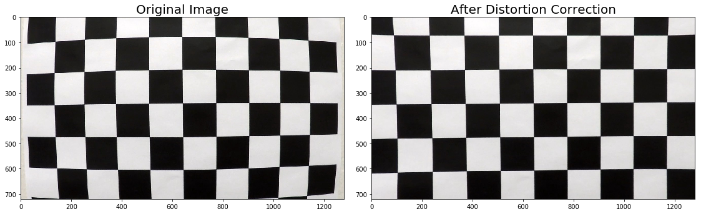
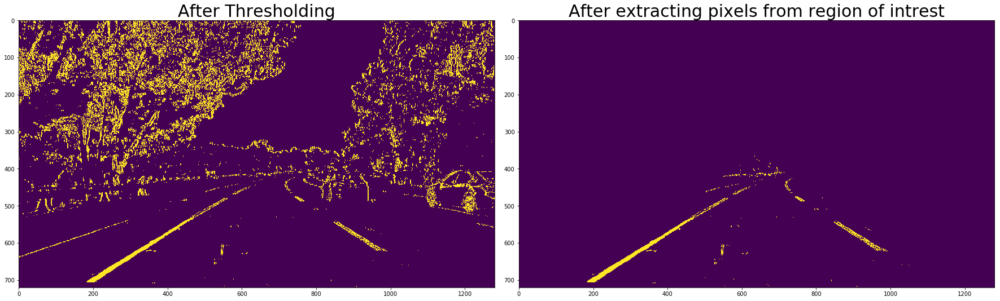
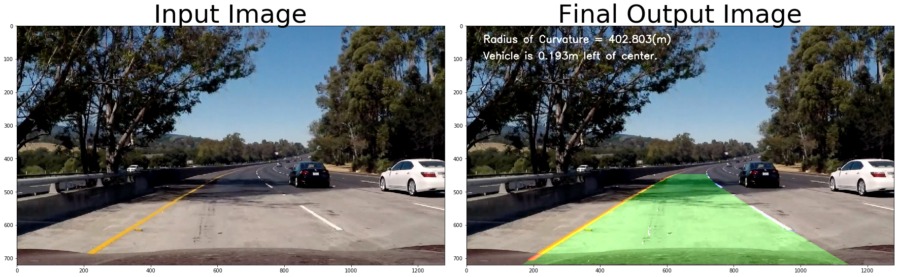
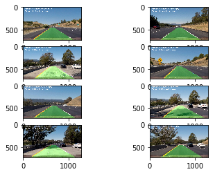


## Advanced Lane Finding Project

The goals / steps of this project are the following:

* Compute the camera calibration matrix and distortion coefficients given a set of chessboard images.
* Apply a distortion correction to raw images.
* Use color transforms, gradients, etc., to create a thresholded binary image.
* Apply a perspective transform to rectify binary image ("birds-eye view").
* Detect lane pixels and fit to find the lane boundary.
* Determine the curvature of the lane and vehicle position with respect to center.
* Warp the detected lane boundaries back onto the original image.
* Output visual display of the lane boundaries and numerical estimation of lane curvature and vehicle position.

---
## Step-1:  Camera Calibration

### 1. Briefly state how you computed the camera matrix and distortion coefficients. Provide an example of a distortion corrected calibration image.

I started by preparing object points, which are x,y,z coordinates of chessboard corner. Since I am using a chessboard image, so the value of z will be 0. I have used some images of chessboard taken with a same camera from different angles and for each image I am calling cv2.findChessboardCorners() method to find corners in chessboard image then I am using these corners with the imagepoints to calibrate the camera using cv2.calibrateCamera() method which returns the distortion coefficients. Then I called cv2.undistort method which uses these distortion coefficients to undistort the images.


```python
# Importing required libraries
import numpy as np
import cv2
import glob
import matplotlib.pyplot as plt
import matplotlib.image as mpimg
%matplotlib qt
```


```python
# Function to compute calibration matrix
def computeCalibrationMatrix(images):
    # prepare object points, like (0,0,0), (1,0,0), (2,0,0) ....,(6,5,0)
    objp = np.zeros((6*9,3), np.float32)
    objp[:,:2] = np.mgrid[0:9,0:6].T.reshape(-1,2)

    # Arrays to store object points and image points from all the images.
    objpoints = [] # 3d points in real world space
    imgpoints = [] # 2d points in image plane.
    image_shape = None

    # Step through the list and search for chessboard corners
    for fname in images:
        # Read the image from the disk         
        img = mpimg.imread(fname)
        # Convert the image to grayscale
        gray = cv2.cvtColor(img,cv2.COLOR_RGB2GRAY)
        # Find the chessboard corners
        ret, corners = cv2.findChessboardCorners(gray, (9,6),None)
        
        # If found, add object points, image points
        if ret == True:
            objpoints.append(objp)
            imgpoints.append(corners)
            image_shape = img.shape
    
    # This will return calibration coefficients             
    return cv2.calibrateCamera(objpoints, imgpoints, image_shape[1::-1], None, None)

# Make a list of calibration images
images = glob.glob('camera_cal/calibration*.jpg')
ret, mtx, dist, rvecs, tvecs = computeCalibrationMatrix(images)
```

## Step-2: Distortion Correction


```python
# Method to undistort camera image
def undistort_camera_image(original_image, mtx, dist):
    return cv2.undistort(original_image, mtx, dist, None, mtx) 
```

Below are the images which I used to find the calbration matrix of my camera


```python
# Chessboard images that I used for calibration
i = 0
while i < len(images):
    # Displaing each image in a 4*5 grid     
    plt.subplot(5,4,i+1)
    plt.imshow(mpimg.imread(images[i]))
    i=i+1
    
plt.show()
```


### 2. Provide an example of a distortion-corrected image.

Distortion correction matrix that was calculated via camera calibration can be applied to undistort the images taken by the camera. Below is an example of an image before after distortion correction. 


```python
original_image = mpimg.imread(images[0])
undistorted_image = undistort_camera_image(original_image, mtx, dist)
f, (ax1, ax2) = plt.subplots(1, 2, figsize=(15, 15))
f.tight_layout()
ax1.imshow(original_image)
ax1.set_title('Original Image', fontsize=20)
ax2.imshow(undistorted_image)
ax2.set_title('After Distortion Correction', fontsize=20)
plt.subplots_adjust(left=0., right=1, top=0.9, bottom=0.)
```





## Step-3: Apply Gradient and Image Thresholding


```python
# Method to apply gradient and thresholding on an input image 
def apply_gradient_and_thresholding(input_image, s_thresh=(150, 255), l_thresh=(120,255), sx_thresh=(20, 100)):
    
    # Convert to HLS color space and separate the V channel
    hls = cv2.cvtColor(input_image, cv2.COLOR_RGB2HLS).astype(np.float)
    l_channel = hls[:,:,1]
    s_channel = hls[:,:,2]
    
    # Apply Sobel x
    sobelx = cv2.Sobel(l_channel, cv2.CV_64F, 1, 0) # This will take the derivative in x
    abs_sobelx = np.absolute(sobelx) # Absolute x derivative to accentuate lines away from the horizontal
    scaled_sobel = np.uint8(255*abs_sobelx/np.max(abs_sobelx))
      
    # Apply Thresholding 
    final_binary = np.zeros_like(s_channel)
    final_binary[np.logical_or((s_channel > s_thresh[0]) & (s_channel < s_thresh[1]) & (l_channel > l_thresh[0]) & (l_channel < l_thresh[1]) , (scaled_sobel > sx_thresh[0]) & (scaled_sobel <= sx_thresh[1]))] = 1
        
    return final_binary
```

### 3. Describe how (and identify where in your code) you used color transforms, gradients or other methods to create a thresholded binary image. Provide an example of a binary image result.

apply_gradient_and_thresholding method has been used to create a binary image containing likely lane pixels. There is no "ground truth" here, just visual verification that the pixels identified as part of the lane lines are, in fact, part of the lines.
In this method I first converted the imags to HLS colorspace since the input images are taken in different lightening conditions, also I applied gradient on input image using cv2.Sobel() method and then I applied thresholding on the input image with given threshold range in input. 
After trying with multiple threshold ranges, finally these below mentioned threshold ranges worked for me.
1. s_thresh=(150, 255),
2. l_thresh=(120,255),
3. sx_thresh=(20, 100)

Below is the example of an image before and after thresholding.


```python
test_image = mpimg.imread('test_images/test5.jpg')
undistorted_test_image = undistort_camera_image(test_image, mtx, dist)
after_thresholding = apply_gradient_and_thresholding(undistorted_test_image, s_thresh=(150, 255), l_thresh=(120,255), sx_thresh=(20, 100))
f, (ax1, ax2) = plt.subplots(1, 2, figsize=(24, 9))
f.tight_layout()
ax1.imshow(test_image)
ax1.set_title('Test Image', fontsize=35)
ax2.imshow(after_thresholding)
ax2.set_title('After applying Gradient and Thresholding', fontsize=35)
plt.subplots_adjust(left=0., right=1, top=0.9, bottom=0.)
```


## Step-4 : Extract Pixels from region of intrest


```python
# Search pixels in region of intrest
def extract_lane_line_data(input_image):
    # Image Dimenstions     
    height = input_image.shape[0]
    width = input_image.shape[1]
    
    # Extrating data from region of intrest     
    mask = np.zeros_like(input_image)
    # Triangle vertices      
    region_of_interest_vertices = np.array([[100,height-1], [width/2, int(height/2)], [width-100, height-1]], dtype=np.int32)
    cv2.fillPoly(mask, [region_of_interest_vertices], 1)
    result = cv2.bitwise_and(input_image, mask)
    return result
```

Below is an example of image before and after extracting lane line points from the region of interst. 


```python
pixels_from_region_of_intrest = extract_lane_line_data(after_thresholding)
f, (ax1, ax2) = plt.subplots(1, 2, figsize=(24, 9))
f.tight_layout()
ax1.imshow(after_thresholding)
ax1.set_title('After Thresholding', fontsize=30)
ax2.imshow(pixels_from_region_of_intrest)
ax2.set_title('After extracting pixels from region of intrest', fontsize=30)
plt.subplots_adjust(left=0., right=1, top=0.9, bottom=0.)
```





## Step-5: Perspective Transformation

To transform an image such that we are effectively viewing objects from a different angle or direction. Here I am transforming this image to get the bird eye view of these lane lines.


```python
# Method to apply perspective transformation on the given input image
def apply_perspective_transformation(input_image, reverse_perspective = False):
    
    # Source patch dimenstions          
    src = np.float32([[200,720], [600, 447], [679,447], [1100,720]])
    # Destination patch dimenstions
    dst = np.float32([[300, 720], [300, 0], [900, 0], [900, 720]]) 
    
    # Image shape    
    height = input_image.shape[0]
    width = input_image.shape[1]    

    # Given src and dst points, calculate the perspective transform matrix
    M = None
    if reverse_perspective:
        M = cv2.getPerspectiveTransform(dst, src)
    else:
        M = cv2.getPerspectiveTransform(src, dst)
    
    # Transforming the image
    warped = cv2.warpPerspective(input_image, M, (width, height))
    # Warp the image using OpenCV warpPerspective()
    return warped
```

### 4. Describe how (and identify where in your code) you performed a perspective transform and provide an example of a transformed image.

OpenCV getPerspectiveTransform() function is used tocalculate the perspective tranformat matrix, and then I used cv2.warpPerspective() fuction to correctly rectify each image to a "birds-eye view". 

Below is an example of these lane lines image before and after perspective transformation.


```python
after_perspective_transformation = apply_perspective_transformation(pixels_from_region_of_intrest, False)
f, (ax1, ax2) = plt.subplots(1, 2, figsize=(24, 9))
f.tight_layout()
ax1.imshow(pixels_from_region_of_intrest)
ax1.set_title('Before Perspective Transformation', fontsize=50)
ax2.imshow(after_perspective_transformation)
ax2.set_title('After Perspective Transformation', fontsize=50)
plt.subplots_adjust(left=0., right=1, top=0.9, bottom=0.)
```


## Step-6 : Detect Lane Lines Curve Equation (Implement Sliding Windows and Fit a Polynomial)

To calculate the equation of lane lines I am using sliding window search algorithm. For that first we need the x coordinates of the lane lines when y = image_height. So to get x coordinates, we'll first draw the histogram of pixel positions on x axis for the bottom half of the warped image.

With this histogram I am adding up the pixel values along each column in the image. In my thresholded binary image, pixels are either 0 or 1, so the two most prominent peaks in this histogram will be good indicators of the x-position of the base of the lane lines. I can use that as a starting point for where to search for the lines. From that point, I can use a sliding window, placed around the line centers, to find and follow the lines up to the top of the frame.


```python
# Method to get the pixels scatter plot of bottom half of the image with respect to x-axis
def get_pixels_scatter_plot(input_image):
    return np.sum(input_image[input_image.shape[0]//2:,:], axis=0)

# Plotting the histogram of the image pixels
histogram = get_pixels_scatter_plot(after_perspective_transformation)
plt.plot(histogram)
```


    [<matplotlib.lines.Line2D at 0x293cc4f6940>]


Here we can see that most of the pixels are on x = ~300 and x = ~950, So we'll assume that these points are of left and right lane lines. Now we'll use the sliding window search algorithm to find and calculate the lane line pixel curve equation.


```python
def apply_sliding_window_search(warped_image, input_prev_left_fit, input_prev_right_fit):
    # Assuming that the input image is warped image
    binary_warped = warped_image.astype(np.uint8)
    
    # Take a histogram of the bottom half of the image
    histogram = get_pixels_scatter_plot(warped_image)
    # Find the peak of the left and right halves of the histogram
    # These will be the starting point for the left and right lines
    midpoint = np.int(histogram.shape[0]//2)
    # Position of left lane line base pixel     
    leftx_base = np.argmax(histogram[:midpoint])
    # Position of right lane line base pixel    
    rightx_base = np.argmax(histogram[midpoint:]) + midpoint
    
    # Create an output image(3 channels) to draw on and visualize the result
    out_img = np.dstack((warped_image, warped_image, warped_image))
    window_img = np.zeros_like(out_img)
    
    # Choose the number of sliding windows
    nwindows = 9
    # Set height of windows
    window_height = np.int(binary_warped.shape[0]//nwindows)
    # Identify the x and y positions of all nonzero pixels in the image
    nonzero = binary_warped.nonzero()
    # y coordinates of all non zero pixels     
    nonzeroy = np.array(nonzero[0])
    # x coordinates of all non zero pixels     
    nonzerox = np.array(nonzero[1])
    
    # Current positions to be updated for each window
    leftx_current = leftx_base
    rightx_current = rightx_base
    # Set the width of the windows +/- margin
    margin = 100
    # Set minimum number of pixels found to recenter window
    minpix = 50
    # Create empty lists to receive left and right lane pixel indices
    left_lane_inds = []
    right_lane_inds = []

    # Step through the windows one by one
    for window in range(nwindows):
        # Identify window boundaries in x and y (and right and left)
        win_y_low = binary_warped.shape[0] - (window+1)*window_height
        win_y_high = binary_warped.shape[0] - window*window_height
        win_xleft_low = leftx_current - margin
        win_xleft_high = leftx_current + margin
        win_xright_low = rightx_current - margin
        win_xright_high = rightx_current + margin
        # Draw the windows on the visualization image
        cv2.rectangle(out_img,(win_xleft_low,win_y_low),(win_xleft_high,win_y_high), (0,255,0), 2) 
        cv2.rectangle(out_img,(win_xright_low,win_y_low),(win_xright_high,win_y_high), (0,255,0), 2) 
        # Identify the nonzero pixels in x and y within the window
        good_left_inds = ((nonzeroy >= win_y_low) & (nonzeroy < win_y_high) & 
        (nonzerox >= win_xleft_low) &  (nonzerox < win_xleft_high)).nonzero()[0]
        good_right_inds = ((nonzeroy >= win_y_low) & (nonzeroy < win_y_high) & 
        (nonzerox >= win_xright_low) &  (nonzerox < win_xright_high)).nonzero()[0]
        # Append these indices to the lists
        left_lane_inds.append(good_left_inds)
        right_lane_inds.append(good_right_inds)
        # If you found > minpix pixels, recenter next window on their mean position
        if len(good_left_inds) > minpix:
            leftx_current = np.int(np.mean(nonzerox[good_left_inds]))
        if len(good_right_inds) > minpix:        
            rightx_current = np.int(np.mean(nonzerox[good_right_inds]))

    # Concatenate the arrays of indices
    left_lane_inds = np.concatenate(left_lane_inds)
    right_lane_inds = np.concatenate(right_lane_inds)

    # Extract left and right line pixel positions
    leftx = nonzerox[left_lane_inds]
    lefty = nonzeroy[left_lane_inds] 
    rightx = nonzerox[right_lane_inds]
    righty = nonzeroy[right_lane_inds] 

    # Fit a second order polynomial to each
    left_fit = np.polyfit(lefty, leftx, 2)
    right_fit = np.polyfit(righty, rightx, 2)
    
    input_prev_left_fit.append(left_fit)
    input_prev_right_fit.append(right_fit)
    
    
    ploty = np.linspace(0, binary_warped.shape[0]-1, binary_warped.shape[0] )
    left_fitx = left_fit[0]*ploty**2 + left_fit[1]*ploty + left_fit[2]
    right_fitx = right_fit[0]*ploty**2 + right_fit[1]*ploty + right_fit[2]
   
    out_img[nonzeroy[left_lane_inds], nonzerox[left_lane_inds]] = [255, 0, 0]
    out_img[nonzeroy[right_lane_inds], nonzerox[right_lane_inds]] = [0, 0, 255]
    
    # Create an image to draw on and an image to show the selection window
    out_img = np.dstack((binary_warped, binary_warped, binary_warped))*255
    window_img = np.zeros_like(out_img)
    # Color in left and right line pixels
    out_img[nonzeroy[left_lane_inds], nonzerox[left_lane_inds]] = [255, 0, 0]
    out_img[nonzeroy[right_lane_inds], nonzerox[right_lane_inds]] = [0, 0, 255]

    # Generate a polygon to illustrate the search window area
    # And recast the x and y points into usable format for cv2.fillPoly()
    left_line_window1 = np.array([np.transpose(np.vstack([left_fitx, ploty]))])
    new_margin = (right_fitx-left_fitx)/2
    left_line_window2 = np.array([np.flipud(np.transpose(np.vstack([left_fitx+new_margin+50, 
                                  ploty])))])
    left_line_pts = np.hstack((left_line_window1, left_line_window2))
    right_line_window1 = np.array([np.transpose(np.vstack([right_fitx-new_margin-50, ploty]))])
    right_line_window2 = np.array([np.flipud(np.transpose(np.vstack([right_fitx, 
                                  ploty])))])
    right_line_pts = np.hstack((right_line_window1, right_line_window2))

    # Draw the lane onto the warped blank image
    cv2.fillPoly(window_img, np.int_([left_line_pts]), (0,255, 0))
    cv2.fillPoly(window_img, np.int_([right_line_pts]), (0,255, 0))
    result = cv2.addWeighted(out_img, 1, window_img, 0.3, 0)

    return result, left_fitx, right_fitx, ploty
```

### 5. Describe how (and identify where in your code) you identified lane-line pixels and fit their positions with a polynomial?

I used sliding window search algorithm to identify lane lines in the rectified binary image. I am calling apply_sliding_window_search method to get the coordinates and coefficients of polynimial fit of the lane line pixels.
 
The left and right line have been identified and fit with a polynomial curved functional form. Below is an example images with line pixels identified and a fit overplotted on the image with yellow color.


```python
left = []
right = []
after_sliding_window_search, left_fitx, right_fitx, ploty = apply_sliding_window_search(after_perspective_transformation, left, right)
f, (ax1, ax2) = plt.subplots(1, 2, figsize=(24, 9))
f.tight_layout()
ax1.imshow(after_perspective_transformation)
ax1.set_title('Before Sliding Window Search', fontsize=50)
ax2.imshow(after_sliding_window_search, cmap='hsv')
ax2.set_title('After Sliding Window Search', fontsize=50)
ax2.plot(left_fitx, ploty, color='yellow', linewidth=5)
ax2.plot(right_fitx, ploty, color='yellow', linewidth=5)
plt.subplots_adjust(left=0., right=1, top=0.9, bottom=0.)
print("Equation of left lane line: " +str(left[0][0])+' x^2 ' + str(left[0][1]) + ' x + ' + str(left[0][2]))
print("Equation of right lane line: " +str(right[0][0])+' x^2 ' + str(right[0][1]) + ' x + ' + str(right[0][2]))
```

    Equation of left lane line: 0.000344099433266 x^2 -0.533161365953 x + 481.877274889
    Equation of right lane line: 0.000500208398322 x^2 -0.749036895161 x + 1210.38349754
    


## Step-7: Reverse Perspective Transformation


```python
after_reverse_perspective_transformation = apply_perspective_transformation(after_sliding_window_search, True)
f, (ax1, ax2) = plt.subplots(1, 2, figsize=(24, 9))
f.tight_layout()
ax1.imshow(after_sliding_window_search)
ax1.set_title('Before Reverse Perspective Transformation', fontsize=30)
ax1.plot(left_fitx, ploty, color='yellow', linewidth=5)
ax1.plot(right_fitx, ploty, color='yellow', linewidth=5)
# Since the polinomial equation after reverse perspective transformation will be different,
# so I am not plotting it on the transformed image.
ax2.imshow(after_reverse_perspective_transformation, cmap='hsv')
ax2.set_title('After Reverse Perspective Transformation', fontsize=30)
plt.subplots_adjust(left=0., right=1, top=0.9, bottom=0.)
```


## Step-8: Skip Sliding Window for subsequent frames

Now we know where the lines are, we have a fit! In the next frame of video I don't need to do a blind search again, but instead I can just search in a margin around the previous line position like this:


```python
def skip_sliding_window_search(warped_image, input_prev_left_fit, input_prev_right_fit):
    # Assuming that the input image is warped image
    binary_warped = warped_image.astype(np.uint8)
    
    # from the next frame of video (also called "binary_warped")
    # It's now much easier to find line pixels!
    # Here I am taking mean of the coefficients of last 10 polinomial fits
    # to detect the equation of lane line is this frame     
    left_fit  = np.mean(input_prev_left_fit[-10:], axis=0)
    right_fit = np.mean(input_prev_right_fit[-10:], axis = 0)
    
    # Identify the x and y positions of all nonzero pixels in the image
    nonzero = binary_warped.nonzero()
    # y coordinates of all non zero pixels     
    nonzeroy = np.array(nonzero[0])
    # x coordinates of all non zero pixels     
    nonzerox = np.array(nonzero[1])
    
    # Set the width of the windows +/- margin
    margin = 100
    
    # Polinimial fit equations of left lane pixels   
    left_lane_inds = ((nonzerox > (left_fit[0]*(nonzeroy**2) + left_fit[1]*nonzeroy + 
    left_fit[2] - margin)) & (nonzerox < (left_fit[0]*(nonzeroy**2) + 
    left_fit[1]*nonzeroy + left_fit[2] + margin))) 

    # Polinomial fit equations of right lane pixels    
    right_lane_inds = ((nonzerox > (right_fit[0]*(nonzeroy**2) + right_fit[1]*nonzeroy + 
    right_fit[2] - margin)) & (nonzerox < (right_fit[0]*(nonzeroy**2) + 
    right_fit[1]*nonzeroy + right_fit[2] + margin)))  

    # Again, extract left and right line pixel positions
    leftx = nonzerox[left_lane_inds]
    lefty = nonzeroy[left_lane_inds] 
    rightx = nonzerox[right_lane_inds]
    righty = nonzeroy[right_lane_inds]
    
    # Fit a second order polynomial to each
    left_fit = np.polyfit(lefty, leftx, 2)
    right_fit = np.polyfit(righty, rightx, 2)
    
    # Generate x and y values for plotting
    ploty = np.linspace(0, binary_warped.shape[0]-1, binary_warped.shape[0])
    left_fitx = left_fit[0]*ploty**2 + left_fit[1]*ploty + left_fit[2]
    right_fitx = right_fit[0]*ploty**2 + right_fit[1]*ploty + right_fit[2]  
    
    # Create an image to draw on and an image to show the selection window
    out_img = np.dstack((binary_warped, binary_warped, binary_warped))*255
    window_img = np.zeros_like(out_img)
    # Color in left and right line pixels
    out_img[nonzeroy[left_lane_inds], nonzerox[left_lane_inds]] = [255, 0, 0]
    out_img[nonzeroy[right_lane_inds], nonzerox[right_lane_inds]] = [0, 0, 255]

    # Generate a polygon to illustrate the search window area
    # And recast the x and y points into usable format for cv2.fillPoly()
    left_line_window1 = np.array([np.transpose(np.vstack([left_fitx, ploty]))])
    new_margin = (right_fitx-left_fitx)/2
    left_line_window2 = np.array([np.flipud(np.transpose(np.vstack([left_fitx+new_margin+50, 
                                  ploty])))])
    left_line_pts = np.hstack((left_line_window1, left_line_window2))
    right_line_window1 = np.array([np.transpose(np.vstack([right_fitx-new_margin-50, ploty]))])
    right_line_window2 = np.array([np.flipud(np.transpose(np.vstack([right_fitx, 
                                  ploty])))])
    right_line_pts = np.hstack((right_line_window1, right_line_window2))

    # Draw the lane onto the warped blank image
    cv2.fillPoly(window_img, np.int_([left_line_pts]), (0,255, 0))
    cv2.fillPoly(window_img, np.int_([right_line_pts]), (0,255, 0))
    result = cv2.addWeighted(out_img, 1, window_img, 0.3, 0)
    
    # Append coefficients of left and right lane in current frame to input left-right fit
    # This will be used in next frame to detect the position of left and right lane points     
    input_prev_left_fit.append(left_fit)
    input_prev_right_fit.append(right_fit)
    
    return result, left_fitx, right_fitx, ploty
```

## Step-9: Calculate Radius of Curvature


```python
# Method to calculate the radius of curvature for a given length of a given fit 
def calculate_radious_of_curvature(length, fitx):
    y_m_per_pix = 30/720 #Meters per pixel in y dimension
    x_m_per_pix = 3.7/700 #Meters per pixel in x dimension

    plot_y = np.linspace(0, length-1, length) #Fit new polynomials to x,y in world space
    fit_cr = np.polyfit(ploty*y_m_per_pix, fitx*x_m_per_pix, 2)
    y_eval = np.max(plot_y) # Calculate the new radii of curvature
    return ((1 + (2*fit_cr[0]*y_eval*y_m_per_pix + fit_cr[1])**2)**1.5) / np.absolute(2*fit_cr[0])
```


```python
# Method to calculate and display radius of curvature of lane lines of the input frame
def radius_of_curvature(final_image, left_fitx, right_fitx):
    left_curve_radius = calculate_radious_of_curvature(final_image.shape[0], left_fitx)
    right_curve_radius = calculate_radious_of_curvature(final_image.shape[0], right_fitx)
    cv2.putText(final_image,'Radius of Curvature = {0:.3f}(m)'.format(np.mean([left_curve_radius,right_curve_radius])), (50, 50), cv2.FONT_HERSHEY_SIMPLEX, 1, (255,255,255), 2, cv2.LINE_AA)
```

## Step-10: Calculate Position of Vehicle from centre


```python
# Method to calculate and display vehicle position from centre of image
def calculate_vehicle_position_from_centre_on_road(final_image, left_fitx, right_fitx):    
    lane_center = (right_fitx[final_image.shape[0]-1] + left_fitx[final_image.shape[0]-1])/2
    x_m_per_pix = 3.7/700 #Meters per pixel in x dimension
    
    center_offset_pixels = final_image.shape[1]/2 - lane_center
    center_offset_mtrs = x_m_per_pix*center_offset_pixels
    
    if center_offset_mtrs >= 0:
        towards = 'left'
    else:
        towards = 'right'
        
    cv2.putText(final_image,'Vehicle is {0:.3f}m '.format(abs(center_offset_mtrs)) + towards +' of center.',(50,100), cv2.FONT_HERSHEY_SIMPLEX, 1, (255,255,255), 2, cv2.LINE_AA)
```

### 6. Describe how (and identify where in your code) you calculated the radius of curvature of the lane and the position of the vehicle with respect to center.

Here the idea is to take the measurements of where the lane lines are and estimate how much the road is curving and where the vehicle is located with respect to the center of the lane. The radius of curvature is given in meters assuming the curve of the road follows a circle.

For the position of the vehicle, I assumed that the camera is mounted at the center of the car and the deviation of the midpoint of the lane from the center of the image is the offset I am looking for. As with the polynomial fitting, converting from pixels to meters.


```python
radius_of_curvature(after_reverse_perspective_transformation,left_fitx, right_fitx)
calculate_vehicle_position_from_centre_on_road(after_reverse_perspective_transformation,left_fitx, right_fitx)
f, (ax1) = plt.subplots(1, 1, figsize=(5, 5))
f.tight_layout()
ax1.imshow(after_reverse_perspective_transformation)
ax1.set_title('After calculating radius of curvature and vehicle position', fontsize=10)
plt.subplots_adjust(left=0., right=1, top=0.9, bottom=0.)
```


## Step-11: Superimpose the detected area back on the original image


```python
# Using cv2.addWeighted() function to superimpose the final_output image on input test_image
result = cv2.addWeighted(test_image, 1, after_reverse_perspective_transformation, 1, 0)
```


```python
f, (ax1) = plt.subplots(1, 1, figsize=(5, 5))
f.tight_layout()
ax1.imshow(result)
ax1.set_title('Final Output', fontsize=10)
plt.subplots_adjust(left=0., right=1, top=0.9, bottom=0.)
```


### 7: Provide an example image of your result plotted back down onto the road such that the lane area is identified clearly.


```python
from moviepy.editor import VideoFileClip
from IPython.display import HTML

class MyImageProcessor(object):
    
    prev_left_fit = []
    prev_right_fit = []
    
    dist = None
    mtx = None
    
    def process_video_frames(self, image):
        if self.mtx == None:
            images = glob.glob('camera_cal/calibration*.jpg')
            ret, self.mtx, self.dist, rvecs, tvecs = computeCalibrationMatrix(images)
        return self.pipeline(image, self.mtx, self.dist)
    
    # Pipeline to process input images     
    def pipeline(self, image, mtx, dist):
           
        # Remove distortion from image         
        undistorted_test_image = undistort_camera_image(image, mtx, dist)
        # Apply gradient and thresholding        
        after_thresholding = apply_gradient_and_thresholding(undistorted_test_image, s_thresh=(150, 255), l_thresh=(120,255), sx_thresh=(20, 100))
        # Reduce noise from the image         
        pixels_from_region_of_intrest = extract_lane_line_data(after_thresholding)
        # Apply perspective transformation         
        after_perspective_transformation = apply_perspective_transformation(pixels_from_region_of_intrest,False)
        
        after_sliding_window_search = None
        left_fitx = None
        right_fitx = None
        ploty = None
        
        if len(self.prev_left_fit) < 10:
            after_sliding_window_search, left_fitx, right_fitx, ploty = apply_sliding_window_search(after_perspective_transformation, self.prev_left_fit, self.prev_right_fit)
        else:
            after_sliding_window_search, left_fitx, right_fitx, ploty = skip_sliding_window_search(after_perspective_transformation, self.prev_left_fit, self.prev_right_fit)
      
        # Apply reverse perspective  
        after_reverse_perspective_transformation = apply_perspective_transformation(after_sliding_window_search, True)
        
        # Calculate Vehicle position and radius of curvature         
        radius_of_curvature(after_reverse_perspective_transformation,left_fitx, right_fitx)
        calculate_vehicle_position_from_centre_on_road(after_reverse_perspective_transformation,left_fitx, right_fitx)
        
        # Superimpose the final_output image on the input image
        result = cv2.addWeighted(image, 1, after_reverse_perspective_transformation, 1, 0)
        
        return result
    
image_processor = MyImageProcessor()
```


```python
final_output_image = image_processor.pipeline(test_image, mtx, dist)

f, (ax1, ax2) = plt.subplots(1, 2, figsize=(24, 9))
f.tight_layout()
ax1.imshow(test_image)
ax1.set_title('Input Image', fontsize=50)
ax2.imshow(final_output_image)
ax2.set_title('Final Output Image', fontsize=50)
plt.subplots_adjust(left=0., right=1, top=0.9, bottom=0.)
```





```python
# Iterating over all images present in test_images folder and saving the output in output_images folder
test_images = glob.glob('test_images/*.jpg')

i = 0
while i < len(test_images):
    final_output_image = image_processor.pipeline(mpimg.imread(test_images[i]), mtx, dist)
    mpimg.imsave('output_images/'+ str(i) + '.jpg', final_output_image)
    plt.subplot(4,2, i+1)
    plt.imshow(final_output_image)
    i= i+1
```





## Step-12: Test the pipeline on video input


```python
video_processor = MyImageProcessor()

output = 'project_video_output.mp4'
clip1 = VideoFileClip("project_video.mp4")
white_clip = clip1.fl_image(video_processor.process_video_frames)
%time white_clip.write_videofile(output, audio=False)
```

    [MoviePy] >>>> Building video project_video_output.mp4
    [MoviePy] Writing video project_video_output.mp4
    

    100%|█████████████████████████████████████████████████████████████████████████████▉| 1260/1261 [05:50<00:00,  3.41it/s]
    

    [MoviePy] Done.
    [MoviePy] >>>> Video ready: project_video_output.mp4 
    
    Wall time: 5min 53s
    


```python
HTML("""
<video width="960" height="540" controls>
  <source src="{0}">
</video>
""".format(output))
```


<video width="960" height="540" controls>
  <source src="project_video_output.mp4">
</video>


